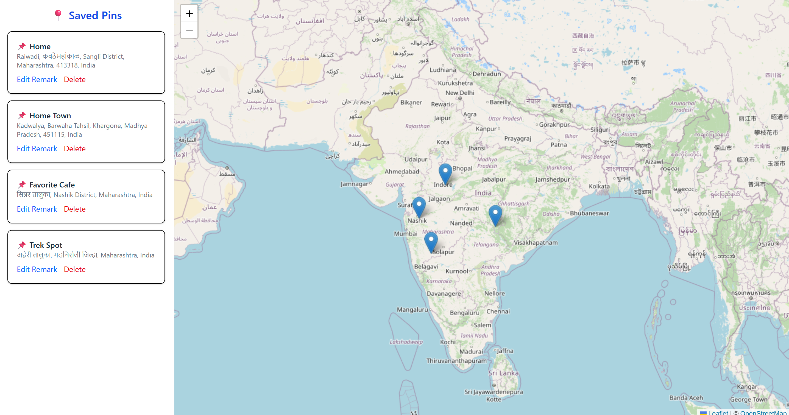
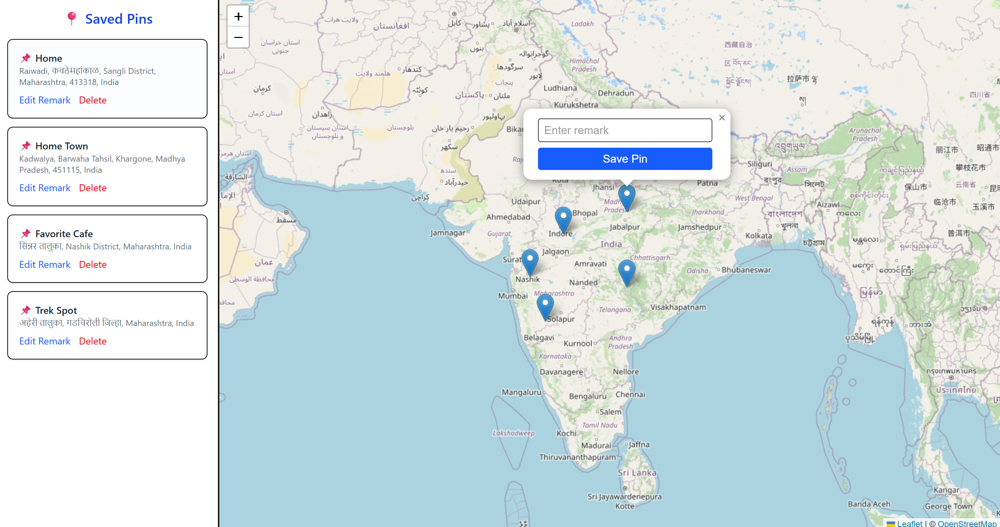
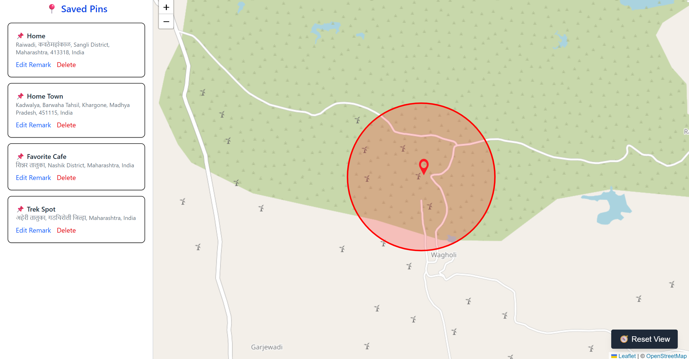
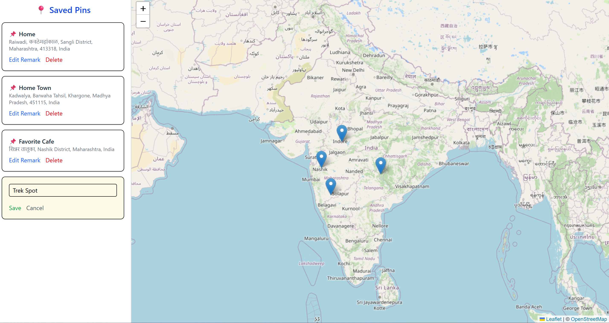

# 📍 PinPointMap

**Tagline:** *"Drop. Discover. Remember."*

PinPointMap is a location bookmarking app that lets you drop pins on the map with personalized remarks and addresses — so you never forget the places that matter.

> ⚠️ This app includes pre-saved pin data for demonstration — feel free to explore the map, view addresses, and interact with pins right away.

---

### 🚀 Live Demo

🔗 [Deployed Live on Vercel](https://pin-point-map-frontend.vercel.app/)<br>
📂 [Backend GitHub Repository](https://github.com/atharva5924/PinPointMap-backend)


---

## 🚀 About

PinPointMap is a React-based interactive map application that allows users to:
- Drop pins anywhere on the map
- Add custom remarks
- Automatically fetch and display addresses using reverse geocoding
- Save, edit, or delete pins
- Fly to a pin upon selection
- Reset the view to the default location
- Store pins persistently in MongoDB via a Node/Express backend

Built with React, React-Leaflet, Node.js, Express, and MongoDB.

---

## 🏗️ Features Overview

1. **Interactive Map** – drop pins anywhere
2. Add *remarks* and fetch *address* from geolocation
3. **Persistent Storage** – saves to MongoDB
4. View pins in a stylish sidebar; fly to pin on click
5. Edit or delete saved pins with inline forms
6. Smooth UI enhancements:
   - Loading state during pin save
   - Reset to default view button
   - Highlight selected pin and smooth transitions

---

## 🛠️ Tech Stack

- **Frontend**: React, React-Leaflet, Tailwind CSS, Axios  
- **Backend**: Node.js, Express, MongoDB, Mongoose  
- **APIs**: OpenStreetMap Nominatim reverse geocoding  

---

## 🧩 Screenshots

## 📸 UI Screenshots

### 🚀 Splash Screen

Branding animation with the tagline “Drop. Discover. Remember.” displayed during app launch.


---

 ### 🗺️ Interactive Map with Saved Pins

A full view of India with saved location markers and a sidebar displaying their remarks and addresses.



---

### 📍 Add New Pin with Remark

Popup appears after clicking the map, allowing users to enter a custom remark and save the pin.



---

### 📋 Sidebar Only View

A compact view of all saved pins with options to edit or delete each one.


---

### 🎯 Highlighted Pin & Reset View

Selected pin is highlighted with a circle and a “Reset View” button appears for easy map reset.



---

### ✏️ Edit Remark Functionality

Inline edit mode in the sidebar allowing users to update pin remarks quickly and easily.



---

### ✅ Notes

- All screenshots are captured with real sample data inserted for demonstration.
- UI is fully responsive and clean, ensuring a great experience across devices.


---

## 🔧 Getting Started

### 1. Clone the repo

```bash
git clone https://github.com/atharva5924/PinPointMap-frontend.git
cd PinPointMap-frontend
```

### 2. Frontend Setup

```bash
git clone https://github.com/atharva5924/PinPointMap-frontend.git
npm install
# Create .env if needed (e.g., REACT_APP_API_URL)
npm start
```

### 3. Backend Setup

```bash
git clone https://github.com/atharva5924/PinPointMap-backend.git
cd PinPointMap-backend
npm install
# Create .env with MONGO_URI and PORT (e.g. 5000)
npm start
```

---

## ⚙️ API Endpoints

| Method | Endpoint         | Description         |
|--------|------------------|---------------------|
| GET    | `/api/pins`      | Fetch all saved pins |
| POST   | `/api/pins`      | Create a new pin     |
| PUT    | `/api/pins/:id`  | Update a pin         |
| DELETE | `/api/pins/:id`  | Delete a pin         |

---

## 📝 Sample Dummy Data

Use this payload to seed your DB or test via Postman:

```json
{
  "lat": 21.1182,
  "lng": 79.0472,
  "remark": "College Campus",
  "address": "IIIT Nagpur, Maharashtra, India"
}
```

---

## 📁 Project Structure – `pin-drop-frontend/`

```bash
pin-drop-frontend/
├── public/ # Static assets (favicon, etc.)
├── src/ # Source code
│ ├── assets/ # Icons and images
│ │ └── react.svg
│ ├── components/ # Reusable UI components
│ │ ├── FlyToPin.jsx # Smooth fly-to-location logic
│ │ ├── MapView.jsx # Main Leaflet map component
│ │ ├── ResetView.jsx # Component to reset the map view
│ │ └── Sidebar.jsx # Sidebar to show all pins
│ ├── App.jsx # Main app wrapper
│ ├── main.jsx # Entry point
│ └── index.css # Global styles
├── .gitignore # Git ignore rules
├── eslint.config.js # ESLint configuration
├── index.html # HTML template
├── package.json # Project metadata and scripts
├── package-lock.json # Dependency lock file
├── vite.config.js # Vite config
└── README.md # Project description (this file)
```

---

### 👨‍💻 Developer

**Atharva Nile**
CSE Undergrad @ IIIT Nagpur
📧 atharvanile2005@gmail.com
🔗 [LinkedIn](https://www.linkedin.com/in/atharva-nile-a50120294) • [GitHub](https://github.com/atharva5924)

---

Let me know once you've added screenshots or deployed it — I can update this file with image previews and final Vercel link if you like!


---


